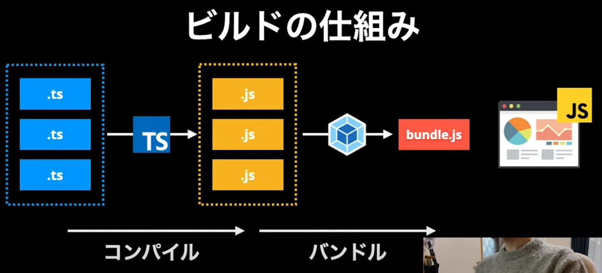
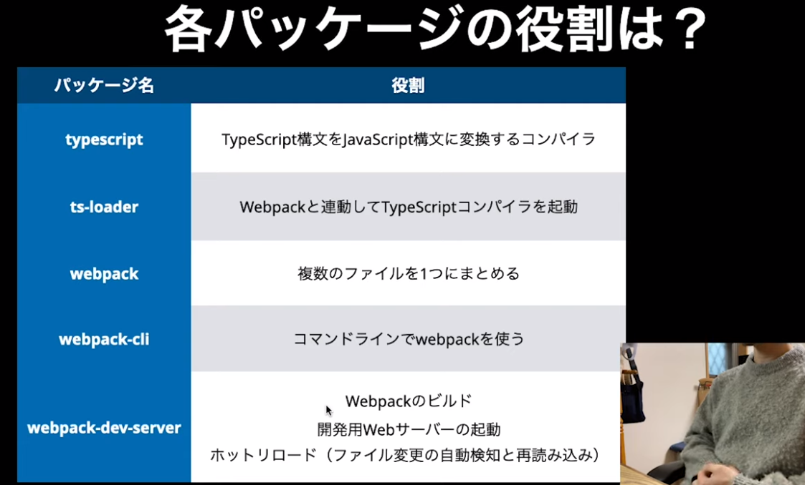
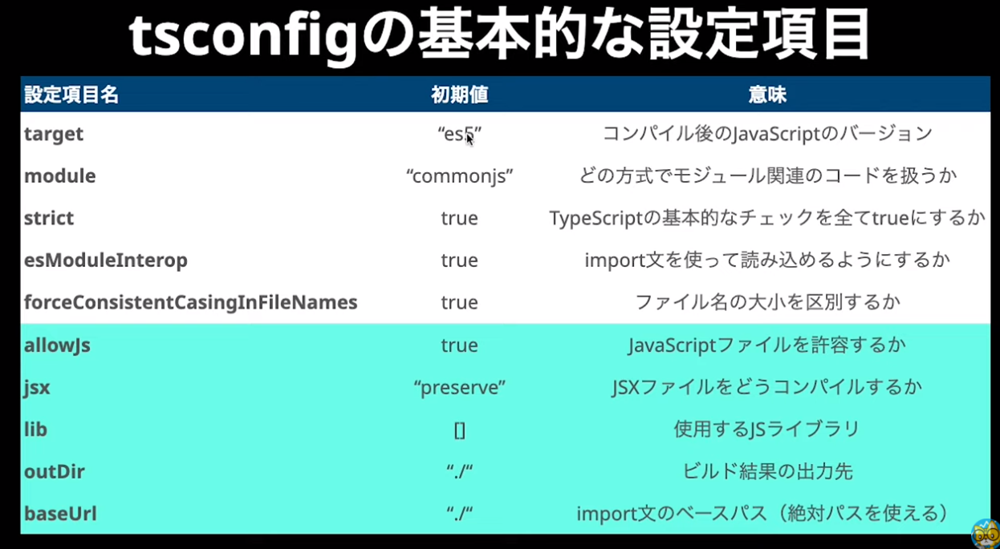

# 環境構築
基本は自動構築だが、実務で扱っているとなんだかんだ触らなきゃいけない機会がある。自分で設定できるようになっとくとよい。特に下記は必須。
- webpack
- tsconfig

# webpack
依存関係を考慮しながらJavaScriptを1ファイルにまとめる（こういうのをモジュールハンドラという）。



# tsconfig
TypeScriptの設定ファイル。これを適切に変更することで、新しい構文で書いたものを古いブラウザでも動くようにできる。

# ハンズオン

## nodeインストール確認
まずはnodeがインストールされていることを確認する。下記コマンドでバージョンが表示されなければインストールされていない。

```console:
node -v
```

## package.jsonファイル作成
package.jsonファイルを作成する。

```console:
npm init -y
```

## 関連パッケージインストール
関連パッケージをインストールする。開発環境でしか利用しないパッケージなので `--save-dev` をつける。これでユーザーが利用したいときに `npm install` で含まれなくなる。

```console:
npm install --save-dev typescript ts-loader webpack webpack-cli webpack-dev-server
```

各パッケージの役割は下記の通り。


## webpackの設定
webpackの設定ファイルを作成する。新規ファイル作成で`webpack.config.js`を作成する。間違えるとうまくいかないので注意（`webpack.config.js`のコードは`src`フォルダ参照）。

## `package.json`を設定
`package.json`を設定する。<br>
"script"をいじる。ここで"build"とか追加すると`npm build`で追加した内容を実行できる。<br>
`"bulid": "webpack --mode=production"` -> webpackを使って本番用の環境をビルドする<br>
`"start": "webpack-cli serve --mode development"` -> 開発環境のwebサーバーを起動する

## tsconfigの設定
tsconfigファイルを作成する。

```console:
./node_modules/.bin/tsc --init
```

各種設定項目は下記の通り。<br>
target -> 'es5'にしておくことで比較的古いブラウザ(IE11等)にも対応できる<br>
module -> 'commonjs'にしておけばnodejsでmodule関連のコードを扱うようになる<br>
strict -> strict以降に記載されている<br>
allowJs -> 今までJSで書いていたファイルを少しずつ更新していくよ！ってときに有効にしとくと便利<br>
baseUrl -> 後々相対パスだと長くて大変だったりどこのファイルかわからなくなるから設定しておくと便利<br>


## 開発環境構築
src、distフォルダ内に書いてあるコードをすべて記述したのち、下記を実行。ブラウザが立ち上がり、Hello World! が表示されていることを確認できるはず。

```console:
npm run start
```

また、ファイルを書き換えると自動でサーバーが再起動して表示内容が変更される。これがwebpack-dev-serverのhot reload機能。

## 本番環境構築
下記をコンソールで実行。

```console:
npm run build
```


# 参考
https://youtu.be/qSHlXcSces8